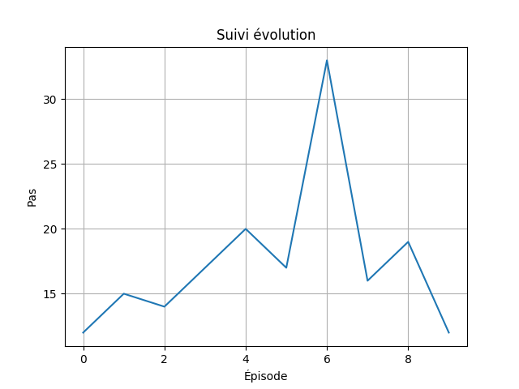

# TPDRL

### Introduction :

Le Deep Q Learning est l’intersection du Deep Learning avec le Q Learning. La méthode itérative servant à calculer les q valeurs, dans le Q learning classique, est remplacé par un réseau de neurones.

### TP :

##### Deep Q-network sur CartPole

###### Début:

**Question 1:** 

Un agent choisit des actions au hazard dans un environnement "CartPole-v1" à partir de son espace d'actions. Nous avons limité son activité à 10 episodes avec un maximum de 100 mouvements/épisode. 

**Question 2:**

Nous calculons la somme des récompenses pour les mouvements réalisés durant chaque épisode pour trouver le score de cet épisode la. Puis, nous affichons une courbe montrant l'évolution de la récompense durant les 10 épisodes selon le nombre de mouvements. Puisque l'agent fait des mouvements aléatoire, il n’apprend pas et l’évolution de récompense est rarement exponentiel.

Exemple:

###### Experience replay:

**Question 3:**

Nous avons implémenté la classe ReplayMemory qui crée la memoire de l'agent selon la taille reçu en paramètre. 
Avec la fonction fillMemoryBuffer(), on ajoute les interactions à la mémoire.
Une interaction est un tuple interaction=(état, action, étatsuivant, récompense, finépisode). 
Si la mémoire est pleine, on vire l’interaction d’indice 0 pour laisser de la place à la nouvelle interaction voulant s’ajouter
La méthode memoryFSpace() retourne la taille de l’espace rempli de la mémoire.

**Question 4:**

La fonction getBatch() de la classe ReplayMemory permet de récupérer un minibatch de taille donné en paramètre. Si la taille entré du batch est supérieur à ce qu'on a dans la mémoire, on retourne tout le contenue de la mémoire.

###### Deep Q-learning:

**Question 5:**
Étant donné que la taille d’un état est 4, le RN qu’on a crée prend en entrée 4. On lui donne la taille de l’action space qui représente le nombre des neurones de sortie. 
C’est un réseau fully connected pour calculer la valeur optimal qui satisfait l’équation de Balman.

**Question 6:**
La stratégie que nous avons choisit c’est la méthode ε − greedy. 
ε étant le ratio d'exploitation, initialisé à 1 au début car l’agent ignore l'environnement. En explorant son environnement, la valeur d’epsilon se décrète grace à la fonction getExplorationRate() implémenté dans la classe Strategie. ε représente la probabilité de vouloir explorer. 

Pour choisir s'il faut faire de l’exploitation ou de l’exploration, une variable r reçoit une valeur au hasard entre 0 et 1. Si cette valeur est supérieure à ε, alors la prochaine action serait d'exploiter, si non, l’agent explore.

Pour mettre à jour les Q valeurs, en exploitant, 
 

**Question 7:**

**Question 8:**

**Question 9:**
