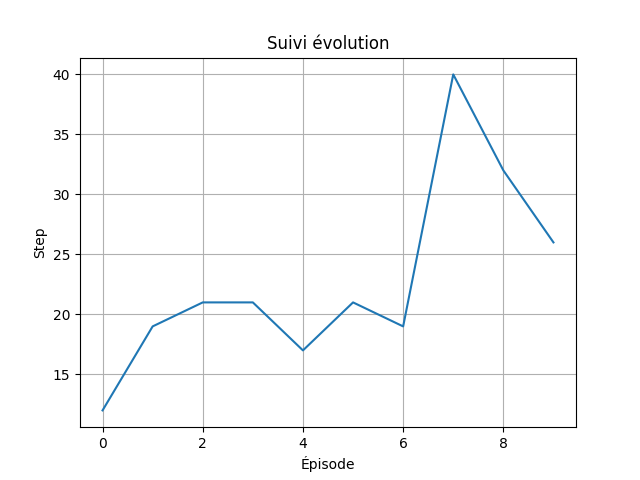

# TPDRL

## Installation :

```
git clone https://github.com/emnabarred/TPDRL.git
cd TPDRL/
pip3 install pipenv
pipenv shell
pip3 install -r requirements.txt
```
## Execution

```
python3 Main.py
```

## Introduction :

Le Deep Q Learning est l’intersection du Deep Learning avec le Q Learning. La méthode itérative servant à calculer les q valeurs, dans le Q learning classique, est remplacé par un réseau de neurones.

## TP :

### Deep Q-network sur CartPole


#### Début:


**Question 1:** 

Un agent choisit des actions au hasard dans un environnement "CartPole-v1" à partir de son espace d'actions. Nous avons limité son activité à 10 épisodes avec un maximum de 100 mouvements/épisode. 

**Question 2:**

Nous calculons la somme des récompenses pour les mouvements réalisés durant chaque épisode pour trouver le score de l'épisode. Nous affichons ensuite une courbe montrant l'évolution de la récompense durant les 10 épisodes selon le nombre de mouvements. Puisque l'agent fait des mouvements aléatoire, il n’apprend pas et l’évolution de récompense n'est pas exponentielle.

Exemple:



#### Experience replay:

**Question 3:**

Nous avons implémenté la classe ReplayMemory qui crée la mémoire de l'agent selon la taille reçu en paramètre. 
Avec la fonction fillMemoryBuffer(), on ajoute les interactions à la mémoire.
Une interaction est un tuple interaction=(état, action, étatsuivant, récompense, finépisode). 
Si la mémoire est pleine, on vire l’interaction d’indice 0 pour laisser de la place à la nouvelle interaction voulant s’ajouter
La méthode memoryFSpace() retourne la taille de l’espace rempli de la mémoire.


**Question 4:**

La fonction getBatch() de la classe ReplayMemory permet de récupérer un mini-batch de taille donné en paramètre. Si la taille entré du batch est supérieur à ce qu'on a dans la mémoire, on retourne tout le contenue de la mémoire.


#### Deep Q-learning:

**Question 5:**

Le réseau neuronal créé est un perceptron multi-couches. Il est composé d'une couche d'entrée de dimension 1x4 (pour correspondre aux dimensions d'un état), d'une couche cachée à activation ReLU et d'une couche de sortie de dimension 1x2 pour chaque action possible. Le réseau est censé calculer la Q-valeur d'un état mais nous n'étions pas sûr de la façon pour y arriver (s'il fallait ajouter un calcul supplémentaire ou non à notre réseau).

On utilise des fonction max et argmax en dehors du réseau neuronal, à l'intérieur des fonctions activant le réseau. 

**Question 6:**
La stratégie que nous avons choisit est la méthode ε − greedy. 
ε étant le ratio d'exploitation, initialisé à 1 au début car l’agent ignore l'environnement. 
Dans la classe stratégie, nous avons implémenté la méthode getExplorationRate() qui donne le ratio de l'exploration (epsilon) après avoir effectué l’expontential decay. Ceci permet de réduire la valeur d’epsilon de façon exponentielle par rapport à sa valeur. ε représente la probabilité d'exploration (1 - ε la probabilité d'intensification/exploitation). 

Pour choisir s'il faut faire de l’exploitation ou de l’exploration, une variable r reçoit une valeur au hasard entre 0 et 1. Si cette valeur est supérieure à ε, alors la prochaine action sera d'exploiter, sinon l’agent explorera.
 

**Question 7:**
Si on utilise le meme réseau de neurone pour trouver la q valeur calculée et la q valeur target, celui ci ne va pas apprendre. L’état actuel et l’état suivant étant successifs, les poids utilisé pour calculer q pour s ne doivent pas êtres les mêmes pour s' ; au lieu de converger, les valeurs vont bouger dans le même sens rendant l'optimisation quasi-impossible.
Au lieu d'utiliser le meme réseau, on a crée un target network pour les q target et un policy network pour les q cackle. Les poids du réseau target sont fixés et égaux au poids originaux du réseau politique. 


**Question 8:**
Nous avons choisi de mettre à jour les poids du réseau target chaque 1000 pas d’apprentissage. N est devenu un hyperparametre pour notre DQN.


#### Expérience plus difficile : VizDoom

Nous avons manqué de temps et n'avons malheuresement pas pu faire cette partie du TP.

